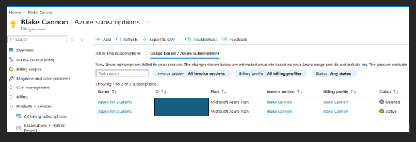

# Activity 1
- Blake Cannon
- April 12th, 2026

## Part 1

## Part 2
Screen Cast link: https://www.loom.com/share/01b6087b8587441abd3c141e5d60e8b3

Example Photos of Application:

- Main browsing page for the drumset store. 

- Form which allows users to add new drumsets to the store.

## Research Questions
- 1: I chose Netflix as my case study which moved its applications and data to the cloud primarily using Amazon Web Services it experienced several important advantages, disadvantages, and challenges. Some advantages that it gained from moving to a cloud based provided was scalability, reliability and cost efficiency. Scalability comes from AWS being able to scale its infrastructure up or down depending on demand. This allows Netflix to handle millions of users without service interruption. Reliability comes in the form that it allows them to distribute its services across multiple regions. Improving up-time and reduction of outages. Even if one region fails it can be rerouted to another. Cost efficiency by moving away from maintaining its own harder which is replaced by the cloud service itself being a pay-as-you-go model which is more flexible and can be adjusted based on usage.Netflix encountered a complex and time-consuming migration process that required redesigning its entire system into a cloud-based architecture. It also became highly dependent on AWS, creating a risk of vendor lock-in and reduced flexibility. Additionally, managing security and user data in a distributed cloud environment introduced new challenges and required stronger oversight. Overall, Netflix’s move to the cloud enabled massive scalability, reliability, and innovation, but it didn’t come without its own set of challenges like migration complexity and vendor dependency.

- 2: I believe the stronger choice between the two for deploying a company’s business application would be to use a cloud-based solution. With the cloud approach it provides scalability, allowing the company to quickly increase or decrease resources based on demand. Another advantage would be the cost efficiency, instead of investing heavily into physical servers, data centers or maintenance the company pays for resources on a subscription or usage basis. Lastly a cloud-based solution provides accessibility in which the application can be accessed from anywhere with an internet connection, enabling remote work and easier integration across teams and locations. All these allows a cloud-based solution to have greater flexibility, lower upfront costs, and easier scalability compared to on-premises infrastructure making it ideal for modern and dynamic business needs.