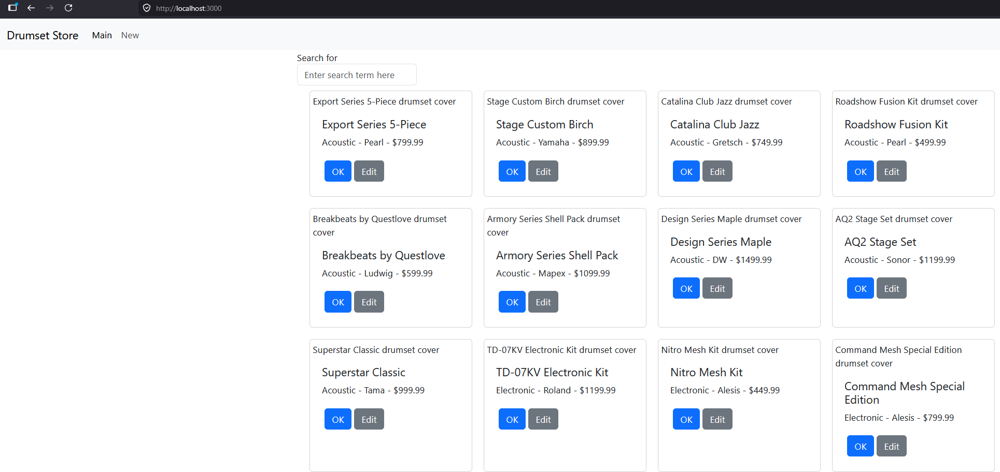
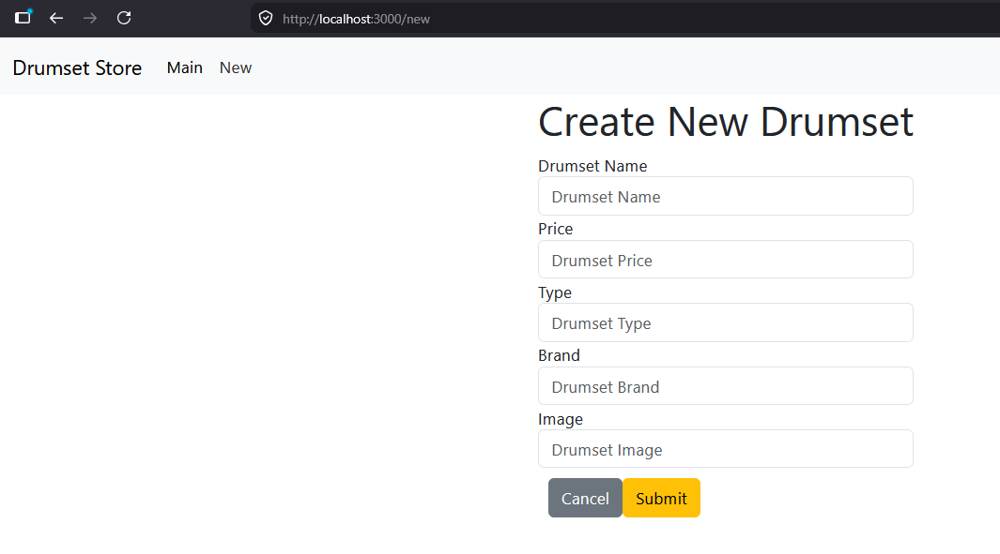

# Activity 2
- Blake Cannon
- April 19th, 2026

## Part 1
Screen Cast link: https://www.loom.com/share/01b6087b8587441abd3c141e5d60e8b3

Example Photos of Application:

- Main browsing page for the drumset store. 

- Form which allows users to add new drumsets to the store.

## Research Questions
- 1: 
The public, private, and hybrid cloud deployment models offer different balances of cost, control, and flexibility. The public cloud, provided by platforms like Amazon Web Services and Microsoft Azure, is cost-efficient and highly scalable, allowing businesses to quickly adjust resources as needed. However, it offers less control over infrastructure and may raise security or compliance concerns, especially for sensitive data. Costs can also grow over time if usage is not carefully managed.The private cloud, often built using technologies such as VMware, provides greater control, stronger security, and predictable performance because resources are dedicated to one organization. The downside is its high upfront cost, limited scalability, and the need for ongoing maintenance by internal IT teams.The hybrid cloud combines both models, enabling organizations to keep critical workloads secure in private systems while leveraging the scalability of the public cloud. This approach offers flexibility and cost balance but introduces complexity in integration, security management, and required expertise.Overall, organizations will usually choose based on priorities such as public for scalability, private for control, and hybrid for a balanced but more complex solution.

- 2: Two widely used SaaS applications are Salesforce and Google Workspace. Some advantages of using Salesforce is no infrastructure management, rapid deployment and continuous updates. You don’t need to provision servers, databases or networking everything is handled by Salesforce, reducing operational overhead. Organizations can start using CRM features almost immediately instead of spending months building a custom system. Last, they regularly roll out improvements, security patches and new capabilities automatically. Some disadvantages of Salesforce though is its high long-term cost which is subscription based and can exceed the cost of a custom-built solution over time. It also has limited customization while configurable, it may not fully match highly specific business workflow compared to custom-built CRM. Vendors lock in may be a concern for some organizations also when migrating away from it can be complex due to proprietary data structures and integrations.Google Workspace advantages come in its ability to be accessible, scalability and built in security. Tools like Docs, Sheets, and Gmail are accessible anywhere with real-time collaboration built in. It also easily supports organizations of any size without needing to upgrade infrastructure. Google manages data redundancy, uptime, and security compliance on its own side. One of the downsides of Google Workspace though is sensitive organizations may prefer on-premise control for compliance or regulatory reasons. Also, while some offline features exist, full functionality requires reliable internet access. It also needs a subscription dependency which can lead to licensing costs and reliance on Google’s pricing and policies.
References:

Salesforce(2026)  https://www.salesforce.com/products/what-is-salesforce/

Google Workspace(2026)  https://workspace.google.com/